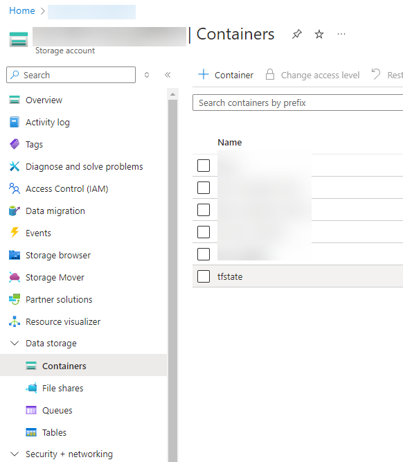
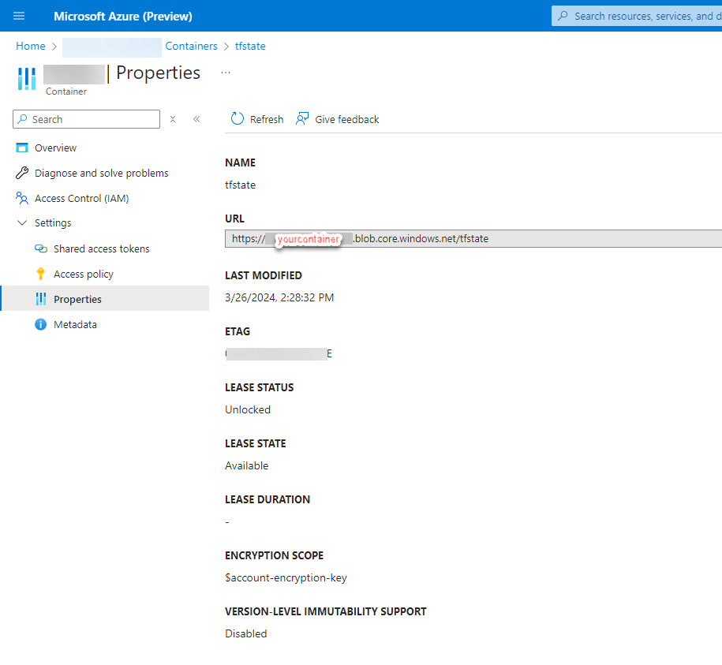
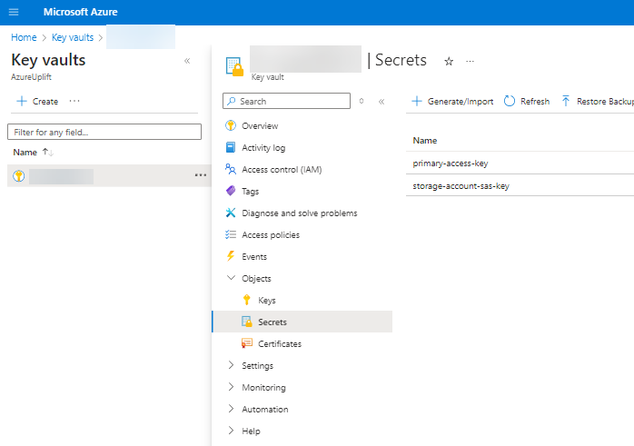
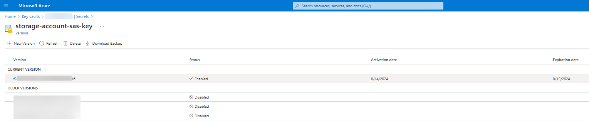
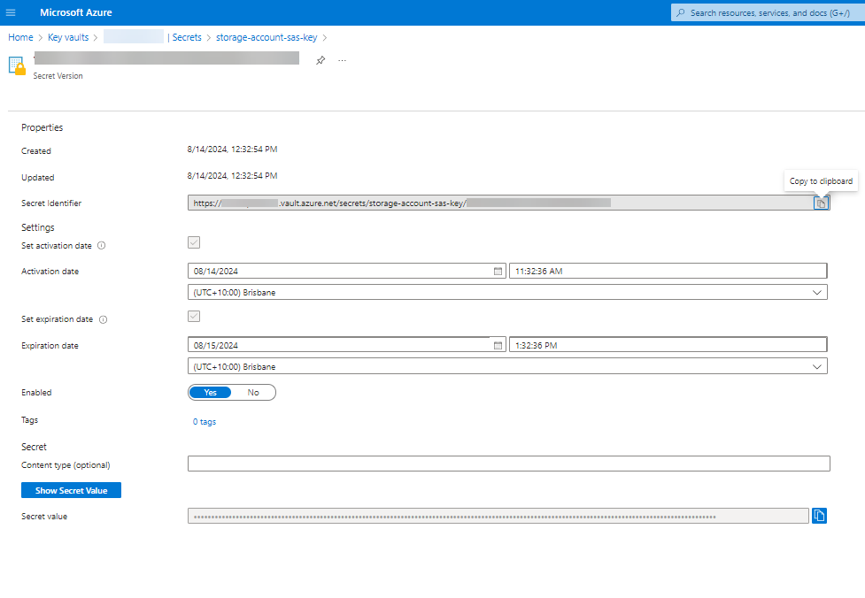
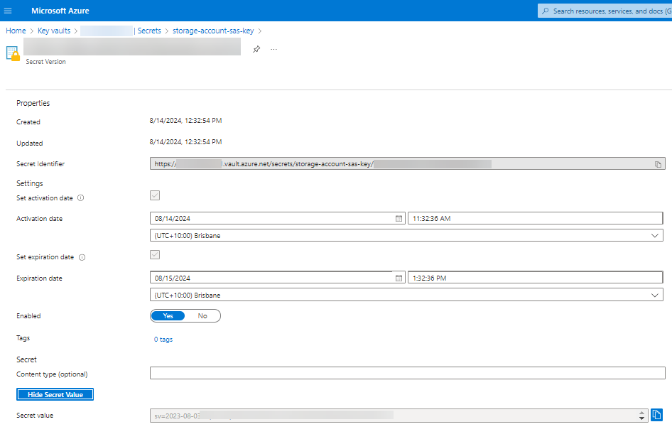
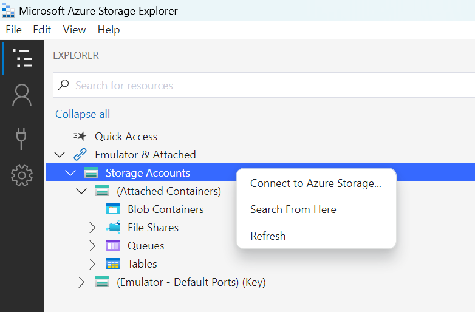
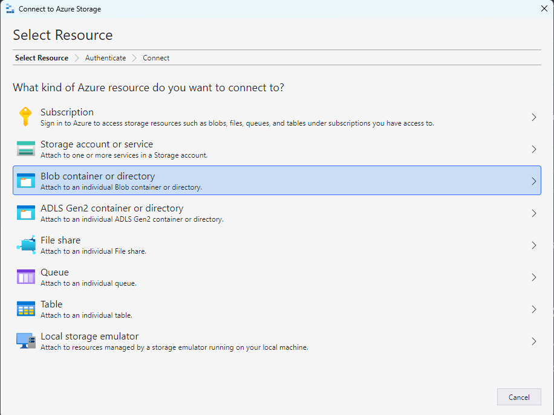
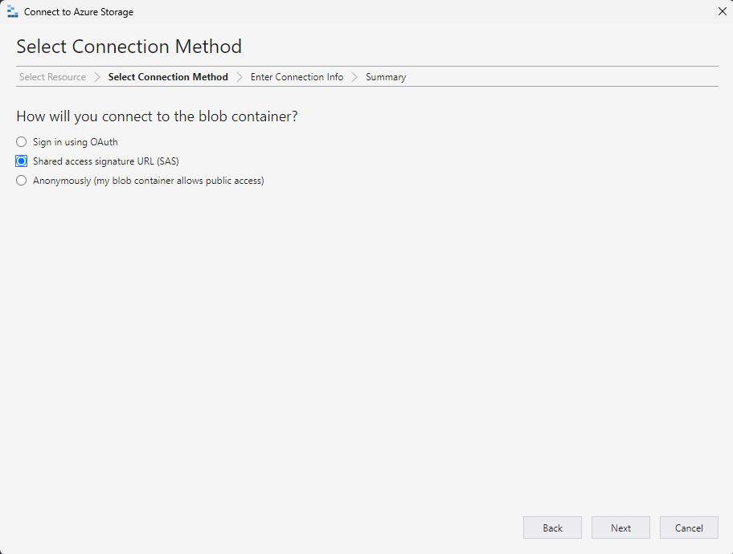
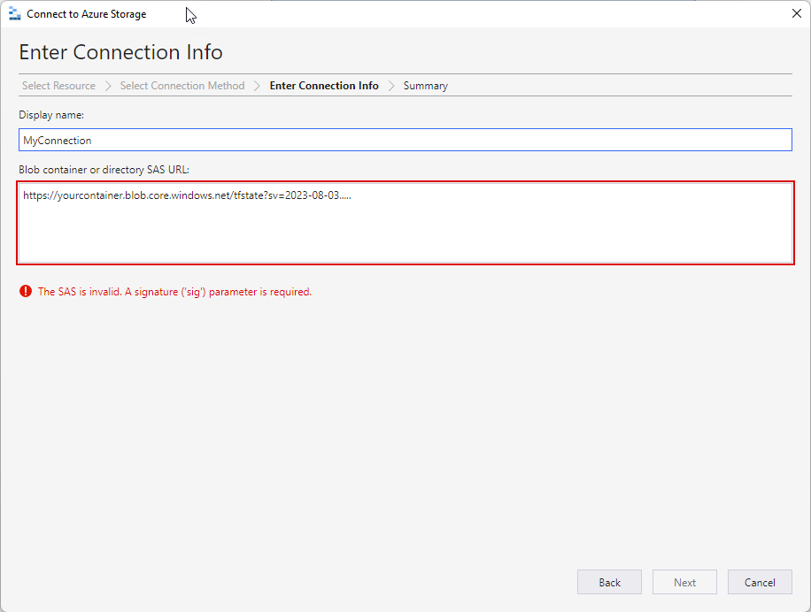

# generate_and_store_sas
This repo will create (or reference) an Azure Storage Account and Container. It will then generate a SAS key for that container and store it in an Azure Key vault created within the code.

## Summary
I have been using Azure DevOps variable groups to store the required SAS key for access to my Terrafrom state files. This required the manual generation of a SAS key and a copy/paste operation to the relevant variable in the variable group. 
I wanted to automate the process and decrease required intervention for CD processes. This repo will implement the below:

- Create or reference a storage account.
- Create or reference a container within that storage account.
- Create an Azure Key vault and assign permissions.
- Obtain the primary access key for the storage account and store it in the Key vault (required to generate the SAS key).
- Generate a SAS key for the container either via native Terraform operations or with PowerShell.
- Store the generated SAS key in the Key vault.

## Quick Start
As the code currently stands the creation of the storage account is commented out in favour of referencing an existing storage account and container. If you do not have a storage account simply invert the 4 sections that are/are not commented out in ./modules/storage_account/main.tf

- Copy the sample file *./environments/demo_env/demo_env-ado-variables.sample* to a new file (and folder) *./environments/your_env/your_env-ado-variables.tfvars* and update the values as appropriate.
- Initialise Terraform

    `terraform init -upgrade`
- Run a terraform plan with your configuration details

    `terraform plan -out main.tfplan -var-file="./environments/your_env/your_env-ado-variables.tfvars"`
- Review the plan and apply the generated plan if it meets expectations

    `terraform apply main.tfplan`

## SAS Generation (via PowerShell) Container Alternatives
Currently the below code generates the SAS key in *./modules/generate_sas/main.tf*:

```PowerShell
$Context = New-AzStorageContext -StorageAccountName $storageAccountName -StorageAccountKey $key
$sasToken = New-AzStorageContainerSASToken -Name $containerName -Permission "racwdl" -Protocol HttpsOnly -Context $Context -StartTime  (Get-Date).AddHours(-1) -ExpiryTime (Get-Date).AddHours(25)
```

Modifying the above parameters will reflect in the generated SAS key for the [Container](https://learn.microsoft.com/en-us/powershell/module/az.storage/new-azstoragecontainersastoken?view=azps-12.1.0). Similarly by adjusting the PowerShell cmdlet an appropriate SAS token could be generated for an Azure Storage [File](https://learn.microsoft.com/en-us/powershell/module/az.storage/new-azstoragefilesastoken?view=azps-12.1.0), [Table](https://learn.microsoft.com/en-us/powershell/module/az.storage/new-azstoragetablesastoken?view=azps-12.1.0), [Queue](https://learn.microsoft.com/en-us/powershell/module/az.storage/new-azstoragequeuesastoken?view=azps-12.1.0), [Share](https://learn.microsoft.com/en-us/powershell/module/az.storage/new-azstoragesharesastoken?view=azps-12.1.0) etc.

## Troubleshooting
[Azure Storage Explorer](https://azure.microsoft.com/en-au/products/storage/storage-explorer) can be used to test the generated SAS key.

- Obtain the Storage Containers URL:
  - Navigate via the Azure portal to the storage account and view the containers blade.
  
    
  - Open the relevant Storage Container and view it Properties. Record the URL.
  
    
- Obtain the stored SAS key
  - Navigate to the Azure Key vault and select the 'Secrets' blade.
  
    
  - Within the Secret that stores the SAS key select the appropriate version. The code will generate a new SAS key every time it is run.
  
    
  - Open the relevant Secret and view its properties.
  
    
  - Select the option to 'Show Secret Value' and record the stored SAS key.
  
    
- Download and install [Azure Storage Explorer](https://azure.microsoft.com/en-au/products/storage/storage-explorer)
  - Launch Azure Storage Explorer and right-click 'Storage Accounts' and select 'Connect to Azure Storage'.
  
    
  - Select 'Blob Container or directory'.
  
    
  - Choose 'Shared access signature URL (SAS)' and 'Next'.
  
    
  - Enter a name for your connection and using the previously recorded values join them with a **'?'** as illustrated.
  
    
  - This screen will advise regarding issues with the supplied SAS key. Regenerate the SAS key with updated options based on the errors received.
- When you have successfully connected to the Azure Storage Container, test expected access aligns with and does not exceed expected permissions levels - modify, create, delete etc.

## Background - Why I implemented an alternative method to generate the SAS key

As referenced in the *variables.tf* file there is currently an open issue [#6519](https://github.com/hashicorp/terraform-provider-azurerm/issues/6519) with the Terraform *azurerm* provider where the SAS token generated via the native Terraform resource provider *azurerm_storage_account_blob_container_sas* issues the SAS token using the storage service version **2018-11-09**.

I wanted to future proof and genericise my repository in case I ran into issues similar to that in [go-azure-helpers #44](https://github.com/hashicorp/go-azure-helpers/issues/44) which caused issues logging application logs from app_service to blob storage.
